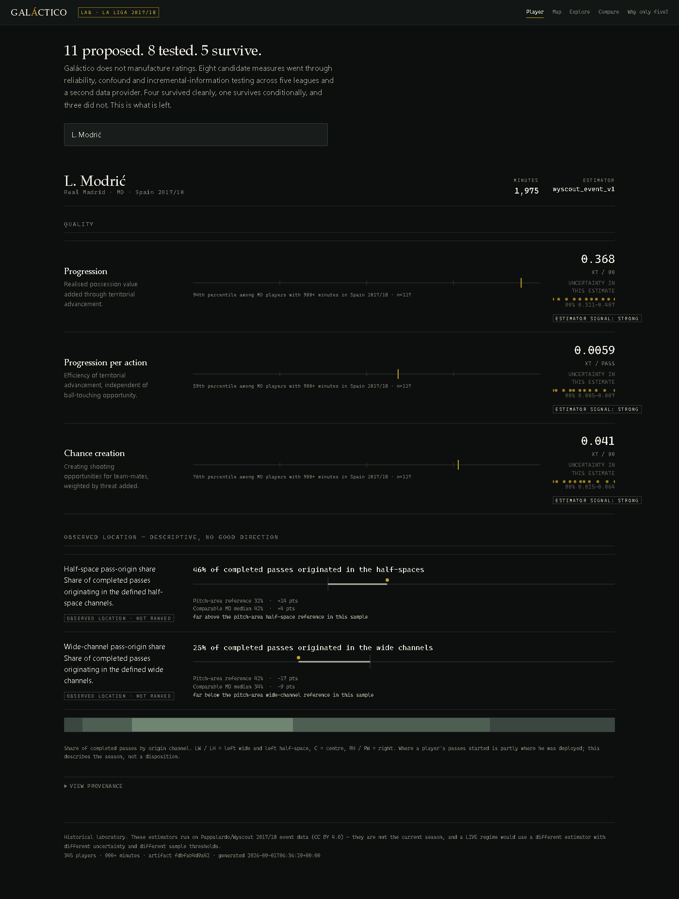
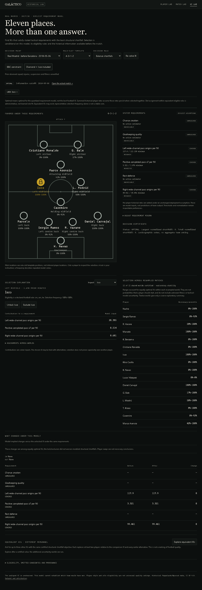
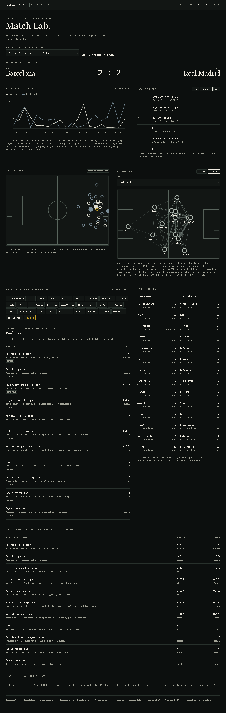

# Galáctico

An open football decision laboratory.

<!-- generated:counts -->
**11 proposed. 8 tested. 5 survive.**

2 rejected, 1 research-only, 3 proposed but not yet through the lifecycle.
<!-- /generated:counts -->



Three connected historical workstations now run locally:

- **Player Lab** — five surviving season constructs, with shared-match uncertainty and evidence gates.
- **Match Lab** — actual lineups, key/tactical timelines, positive pass-xT flow, shot locations, inferred passing networks and player-match contribution vectors.
- **XI Lab** — exact assignment under explicit requirements, structural deficits, lock/exclude/reoptimize, and tie-aware selection stability. Two pre-match Madrid scenarios support 4-3-3 and 4-3-1-2, including explicit BBC and Isco constraints.

XI Lab does **not** identify the best football XI. It finds feasible XIs with the
least shortfall against declared progression and pass-origin requirements.
Thresholds and eligibility are inspectable rules; finishing, defensive structure,
goalkeeping quality and fitness are not modeled.



Most football analytics projects ask what statistics they can calculate.
Galáctico first asks whether the statistic means what its name implies.

That question has killed more metrics here than noise has.

---

## Three ways a football metric fails

**Metronome Fit** — reliable, and measuring the wrong thing. Split-half **0.94**,
higher than expected threat, with a leaderboard of Kroos, Iniesta, Busquets and
Modrić. Exactly the players you would name. It was measuring touch volume: among
deep players it correlated **0.93** with raw touch count, and touch volume plus
team identity explained ~90% of its variance. A preregistered replication on a
different provider and season did not reject it either — two of five tests failed
and the frozen rule required a different combination. It is not shipped, and it is
not closed. [E-01](docs/research/E-01-metronome-fit.md) ·
[E-02](experiments/preregistered/E-02-metronome-confirmatory/analysis.md)

**Ball retention** — reliable, honest, and redundant. Reliability 0.87–0.90 in all
five leagues, and a **0.93–0.95** correlation with plain pass completion
percentage in every one of them. The threat-weighting that justified its existence
moved about 5% of its variance. Pass completion already exists and is simpler.
[E-03](docs/research/E-03-ball-retention-incremental-value.md)

**Verticality** — reliable, and mostly geometry. Reliability 0.97, and roughly
**83%** of its variance is where the player receives the ball. Within a
field-position stratum the relationship largely vanishes.

Reliability tells you a measurement is repeatable. It does not tell you what is
being repeated.

---

## What survives

<!-- generated:claims -->
- **Progression** — Realised possession value added through territorial advancement.
- **Progression per action** — Efficiency of territorial advancement, independent of ball-touching opportunity.
- **Chance creation** — Creating shooting opportunities for team-mates, weighted by threat added.
- **Half-space pass-origin share** — Share of completed passes originating in the defined half-space channels.
- **Wide-channel pass-origin share** — Share of completed passes originating in the defined wide channels.
<!-- /generated:claims -->

<!-- generated:constructs -->
| Construct | Family | Denominator | Minutes floor | External replication |
|---|---|---|---:|---|
| `progression` — Progression | quality | per 90 minutes | — | robust with shift |
| `progression_per_action` — Progression per action | quality | completed passes | — | robust with shift |
| `chance_creation` — Chance creation | quality | per 90 minutes | 1800 | robust with shift |
| `half_space_share` — Half-space pass-origin share | style | completed passes | — | robust with shift |
| `width` — Wide-channel pass-origin share | style | completed passes | — | robust |
<!-- /generated:constructs -->

The two spatial constructs are deliberately named after what enters the numerator.
They describe **where completed passes originated**, which includes where the
player was deployed. They do not establish a preference — that would need
[E-04](experiments/preregistered/E-04-conditional-spatial-tendency/preregistration.md),
which has not been run. Calling them "width" and "half-space preference" would
repeat the verticality error with a different name.

<!-- generated:rejected -->
| Construct | Status | Why |
|---|---|---|
| `ball_retention` | rejected | Too similar to ordinary pass completion |
| `verticality` | rejected | Mostly explained by starting field position |
| `metronome_fit` | research only | Construct validity unresolved after preregistered replication |
<!-- /generated:rejected -->

**There is no overall rating**, and a test fails the build if one appears.

---

## Running it

```bash
uv venv
uv pip install -e ".[dev,api]"
uv run python scripts/fetch_pappalardo.py --only Spain
uv run python scripts/prepare_lab.py
uv run uvicorn galactico.api.player_lab:app --host 127.0.0.1 --port 8090
```

Open `http://127.0.0.1:8090/`, `/match?id=2565907`, or `/xi`.
The first match/snapshot request loads the historical corpus and fits its xT surface;
XI's default 12 shared worlds are deliberately coarse exploratory diagnostics.
They report **necessary–possible frequencies across equally optimal solutions**,
not probabilities of being the best player. More worlds are available through the API.

```bash
uv run ruff check galactico tests
uv run pytest -q
uv run python scripts/check_licensing.py
npm install
npx playwright install chromium
npm test
```

Playwright starts its own local server and tests the actual historical data surfaces.
`make install`, `make prepare`, `make serve`, `make check` and `make e2e` are shortcuts
where Make is available. No API key is needed for this public historical release.

The repository contains **no football data**. Corpora are downloaded at runtime
into a gitignored cache under each provider's own terms, and a CI guard fails on
any attempt to commit one.

---

## Where the data comes from, and what it costs

| Tier | Source | Licence |
|---|---|---|
| LAB, public | Pappalardo/Wyscout 2017/18, five leagues | CC BY 4.0 |
| LAB, local only | StatsBomb open 2015/16, four leagues | restrictive EULA |
| VISION | SkillCorner, DFL/Sportec | MIT, CC BY 4.0 |

All three shipped labs are **historical**. They run on 2017/18 event data and are badged `LAB` in
the interface. A LIVE regime would use a different estimator with different
uncertainty and different sample thresholds, which is why constructs and
estimators are separate objects in the registry.

Two things verified and closed: **FotMob** exposes a season-scope shotmap with
coordinates, and its terms and `robots.txt` forbid the use — it is Opta underneath,
unhidden. **UEFA** publishes exactly the physical metrics this project wanted,
through keyless JSON, and clause 6.2 of its terms bars systematic collection,
scripted access, and using the content to develop or train any model. Both are
`REFERENCE_ONLY`. Neither has an adapter. **No LIVE model is shipped; its planned
scope excludes a physical axis without a permitted source.**
[FotMob](docs/research/FOTMOB-RECON.md) ·
[UEFA](docs/research/UEFA-PHYSICAL-DATA.md) ·
[gap matrix](docs/LIVE-DATA-GAP-MATRIX.md)

---

## State

| Stage | | |
|---|---|---|
| 0 | Foundations | complete |
| 1 | Measurement — five leagues | complete |
| 1B | Replication + reconnaissance | complete |
| 1C | External provider + season shift | complete |
| 2 | Player Lab | implementation frozen; statistical/API/browser gates repaired and verified |
| Match | Match Lab | public historical v1 implemented |
| 3 | XI Lab | experimental requirement engine implemented |
| Next | Opponent / Transfer | requirement and candidate-injection foundations only |

Independent agent reviews and actual browser inspection were performed. External
human football/statistical acceptance has **not** been claimed; `make release-check`
keeps that distinction explicit. Implementation status is not decision validation.

Two important negative results accompany this release:

- A role-standardized match-score candidate correlated **0.988 / 0.982** with ordinary positive pass-xT in Spain / England. It is a renamed reference scale, not an identified overall contribution score. Match Lab stays vector-valued. [E-05](docs/research/E-05-match-score.md)
- In 12 late-season Madrid fixtures, the requirement engine's representative XI matched **6.00** actual starters on average, below the eligible prior-minutes baseline's **6.83**. This development diagnostic measures manager agreement, not counterfactual quality. [E-06](docs/research/E-06-lineup-requirements.md)

The next preregistered forecast study could not fit its model: requiring all ten
starters to meet the current evidence floor left **3 development observations**, below
the frozen minimum of 50. No forecast skill or failure is inferred from that lack of
coverage. [E-07](experiments/preregistered/E-07-lineup-transport/analysis.md)



Shots have no invented xG. Networks identify inferred rather than observed
recipients. Threat flow is positive completed-pass xT, **not momentum**.
[Capability matrix](docs/research/MATCH-INTELLIGENCE-CAPABILITY-MATRIX.md) ·
[Exact continuation checkpoint](docs/ASTRA-CHECKPOINT.md)

---

## Method notes

The failures were more instructive than the successes, so they are kept.

- [M-01](docs/research/M-01-self-consistent-tests-can-be-wrong.md) — a test suite can be consistent with the code while both are wrong about reality
- [M-02](docs/research/M-02-definition-code-divergence.md) — a metric can be validated and stable while its public definition describes a different quantity
- [M-03](docs/research/M-03-shell-is-not-product.md) — a 200 response is not a working application
- [M-04](docs/research/M-04-shared-match-worlds.md) — independent teammate bootstraps destroy the covariance needed for comparisons
- [M-05](docs/research/M-05-optimizer-selection-bias.md) — exact optimization still selects positive estimation noise

Every one is the same shape: **verification placement matters as much as
verification existence.**

Full results: [Stage 1](docs/research/STAGE-1-MEASUREMENT-REPORT.md) ·
[Stage 1B](docs/research/STAGE-1B-REPLICATION-REPORT.md) ·
[Stage 1C](docs/research/STAGE-1C-EXTERNAL-REPLICATION.md) ·
[decisions](DECISIONS.md) · [limitations](KNOWN_LIMITATIONS.md)

---

## Licence

MIT, for the code.
