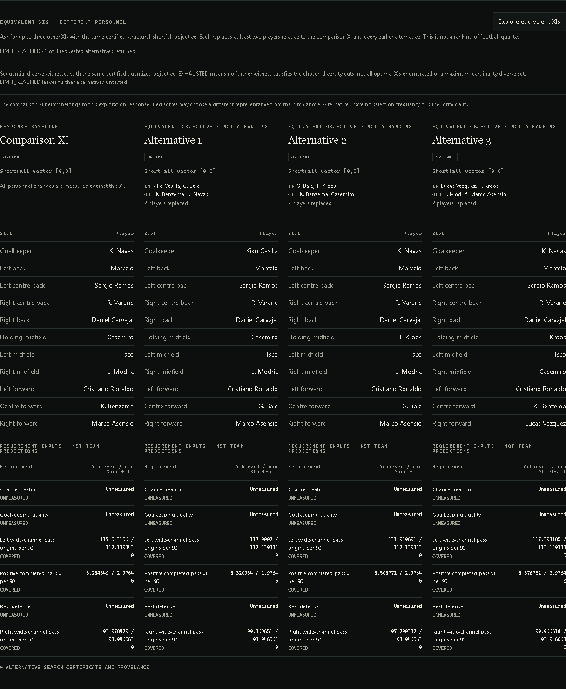

# Different personnel, the same declared objective

XI Lab now exposes up to three alternative XIs in the browser (up to five through
the API). They are witnesses of the **same certified quantized maximum and total
normalized shortfalls** as a comparison XI. They are not ranked football teams,
predicted outcomes, Pareto points or robust recommendations.

## Exact search contract

First solve the unchanged lexicographic requirement problem. Exploration is allowed
only after both objective stages are certified optimal. Clone that optimum region,
fix both objective values, clear the objective and add membership constraints:

`overlap(new_XI, each_previous_XI) <= formation_size - minimum_player_changes`.

Previous XIs include the comparison XI and every returned alternative. The default
minimum is two players **replaced**: at least two outgoing and two incoming players,
not merely a two-element symmetric difference or swapped slot labels. Eligibility,
locks, exclusions and hard requirements are unchanged. Missing active measurements
remain unavailable; this feature supplies no new measurements or utility weights.

Membership/tie analysis uses the unmodified optimum region. Diversity cuts are not
propagated into bootstrap worlds. Alternatives therefore have no new selection
frequency or necessity claim. The exploration endpoint requests no bootstrap worlds.

## What the certificate says

| Search status | Meaning |
|---|---|
| LIMIT_REACHED | Requested witnesses returned; further alternatives untested |
| EXHAUSTED | No next witness satisfies all chosen sequential diversity cuts |
| TIME_LIMIT | Search incomplete; remaining alternatives may exist |
| UNCERTIFIED_BASELINE | No certified two-stage optimum, so no equivalence claim |
| MODEL_INVALID | Solver rejected the exploration model |
| NOT_REQUESTED | Normal solve without alternative exploration |

EXHAUSTED does **not** mean every optimal XI was enumerated, nor that the returned
set has globally maximum cardinality. This is sequential witness search, not a
maximum-diversity optimization. A FEASIBLE constraint witness can still certify
objective equality because both values are fixed to an independently certified
baseline; witness status and inherited objective certification remain separate.

Each alternative contains assignments, raw requirement achievements/deficits,
the objective vector, personnel changes, a parent input fingerprint and a hash of
the exact additional constraints. Exploration policy has a separate version/hash;
requesting more witnesses does not change the underlying decision-input identity.
Raw values can differ while quantized objective vectors tie. Inspect the raw
requirements and the inherited rounding bound, especially near hard thresholds.

## Product behavior

After a certified solve, click **Explore equivalent XIs**. The comparison XI belongs
to that response: a tied solver representative may differ from the pitch above.
The dense roster/requirement ledger makes that comparison explicit. Gold is not a
merit signal for any alternative. Goalkeeping quality, creation and rest defense
remain unmeasured where they were unmeasured before.

Changing scenario, formation, locks, exclusions or minima invalidates old results.
Pending responses are discarded after such a change. Unapplied minima edits disable
exploration until the displayed problem is solved again. The frontend renders
backend certificates and contributions; it does not determine equivalence.

```text
POST /api/xi/alternatives
{
  "scenario_id": "madrid-2018-05-06",
  "formation": "4-3-3",
  "locks": [],
  "excludes": [],
  "mode": "BALANCE",
  "minimums": {},
  "alternative_count": 3,
  "minimum_player_changes": 2
}
```

## Verification

Independent exhaustive tiny-instance enumeration checks objective equality and
membership. Tests distinguish equal maximum/worse total losses, pairwise personnel
diversity, unchanged tie analysis, bootstrap isolation, eligibility, locks, missing
measurements, input order, feasible witnesses, deadlines and conditional exhaustion.
One initial fixture sat on the known integer-rounding boundary (three rounded
thirds fell below a hard minimum); its eligibility test now uses an exact normalizer.
The solver's rounding policy was not weakened to make that test pass.

The actual default Madrid snapshot returns three witnesses with objective [0, 0],
each replacing two players, under its original nonzero minima. Playwright compares
the rendered eleven-player rosters and objective vectors with the real API response,
checks 390px overflow, and delays a response while changing a lock to verify stale
results do not reappear. Desktop and mobile screenshots are inspected separately.



[Mobile roster capture](../screenshots/14-xi-alternatives-mobile.png).
