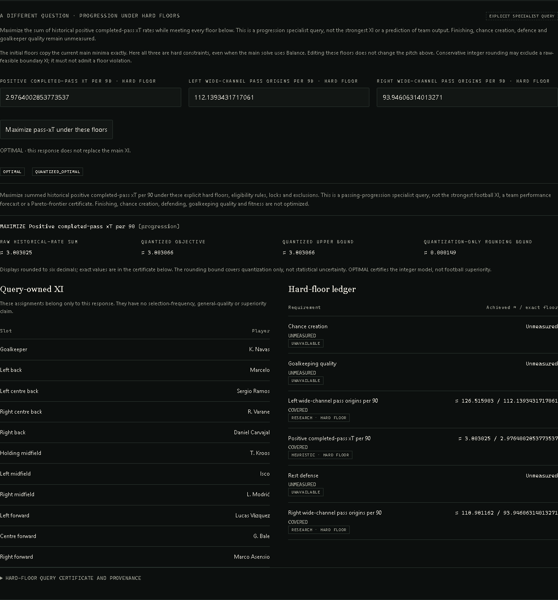

# Passing capacity under explicit floors

## Decision claim

> Among eligible XIs satisfying these user-declared hard floors, maximize the sum
> of selected players' historical positive completed-pass xT per 90.

This is a **passing-progression specialist query**, not a strongest-XI claim. The
objective is chosen by the user; it is not a learned or universal football utility.
Finishing, chance creation, defending, goalkeeping quality and fitness are not
optimized. Historical player rates need not persist in a different deployment.

Two independent formulation/product reviews agreed on this separate question.
BALANCE stops rewarding surplus after all requirements are covered. Equivalent-XI
witnesses intentionally retain that objective. Neither feature should silently
start maximizing progression.

An exploratory May 6 diagnostic already showed why this distinction matters:
maximizing progression can omit Ronaldo, Benzema and Casemiro. This was a
development diagnostic, not preregistered football validation. The product must
put its narrow objective next to the answer, not bury it in provenance.

## Explicit policy, not an implicit tradeoff weight

- The HTTP product maximizes progression only. Left/right wide-channel pass-origin
  rates remain RESEARCH deployment descriptors, not qualities to maximize.
- All three floors are supplied explicitly in original units. The interface
  copies the current minima into editable fields, but discloses that they become
  **hard floors in this separate query**, even if the main pitch uses BALANCE.
- Role-slot eligibility, observed-squad/sample gates, locks and exclusions remain
  unchanged. Missing active measurements exclude affected assignments, not become
  zeros. Unmeasured requirements remain visible.
- Impossible requests stay INFEASIBLE. No retry with weaker floors, reduced locks
  or different eligibility is allowed.
- Each response owns its XI and requirement ledger. It does not replace the main
  pitch, inherit its frequencies or rank personnel against other policies.

This is an epsilon-constraint formulation: choose one objective and constrain
other dimensions explicitly. A query is **not a Pareto-frontier certificate**.
An objective-optimal representative can tie another XI with larger side-origin
counts. A handful of user queries is not an exhaustive frontier, nor evidence that
larger side-origin counts are preferable in football.

## Numerical policy

Hard floors use conservative quantization, separate from the existing solver:

```text
q_floor(value) = floor(value / normalizer * scale)
q_target(minimum) = ceil(minimum / normalizer * scale)
sum(q_floor(selected values)) >= q_target(minimum)
```

Exact rational representations of the numerical inputs avoid intermediate
floating-point rounding flipping a floor or ceiling. Conservative-feasible
assignments satisfy the original numerical floor. The converse does not hold:
boundary-feasible raw XIs can be excluded. With m applicable slots, the raw
tightening is less than `(m + 1) * normalizer / scale`; the response exposes a
requirement-specific bound. No optimality claim extends to the unquantized
feasible set.

Objective coefficients use nearest-half-even rounding, separately from floor
coefficients. The certificate distinguishes the raw achieved sum, integer
incumbent/upper bound, quantized objective in original units, and rounding
allowance. The upper bound is not a confidence interval or a bound on football
performance. Ties have no football preference and do not constitute a stable core.

The old BALANCE/SATISFY half-even policy and equivalent-XI fingerprints remain
unchanged. This new conservative feasible region is not the same decision problem
as the pitch above it.

## API and provenance

```text
POST /api/xi/tradeoff
{
  "scenario_id": "madrid-2018-05-06",
  "formation": "4-3-3",
  "locks": [],
  "excludes": [],
  "floors": {
    "progression": 2.9,
    "left_pass_origins": 112,
    "right_pass_origins": 94
  }
}
```

These example floors illustrate the request, not a validated tactical preset.
All floor fields are required, finite numbers between 0 and 1000. `mode`,
`bootstrap_worlds`, `minimums` and alternative-search fields are rejected, not
silently ignored. The endpoint loads the same strictly pre-match snapshot with
zero bootstrap worlds and no new provider.

The result uses a distinct typed maximizing certificate, not the old minimizing
`objective_vector`. OPTIMAL certifies the quantized objective on the conservative
feasible set. FEASIBLE supplies an incumbent without optimality; UNKNOWN does not
mean infeasible; INFEASIBLE certifies this constrained numerical problem only.
MODEL_INVALID remains separate. Fingerprints record the target, actual floors,
normalizers, rounding policy, formation, candidates and constraints. Source
manifests, cutoff, feature versions, solver package and seed remain traceable.

Request errors return JSON-safe diagnostics without reflecting arbitrary invalid
values. A regression covers JSON numeric overflow (`1e999`): rejection must return
422 rather than fail while serializing infinity in the error response. The route
wrapper follows FastAPI's documented
[custom APIRoute pattern](https://fastapi.tiangolo.com/how-to/custom-request-and-route/).

## Verification

Independent exhaustive enumeration checks 36 randomized small instances, plus
targeted numerical and football-rule edge cases. Unit/API checks cover:

- independent exhaustive tiny-instance optimum/membership, conservative floor
  boundaries, missing data, eligibility, slot incidence and lock cascades;
- monotonicity of the certified maximum as an otherwise-identical floor rises;
- maximizing statuses/bounds and candidate-order invariance;
- actual Madrid snapshots without treating plausible personnel as ground truth;
- fresh result provenance without inherited bootstrap, tie or alternative claims;
- strict API fields, unavailable dimensions, user-declared versus default threshold
  provenance and JSON-safe validation errors.

The real historical development smoke test gives the following results when both
side-origin floors change and the progression floor remains fixed. These are
model-specific test cases, not recommended presets or football validation:

| Side-origin floors | Raw progression sum | Certificate |
|---|---:|---|
| Existing historical minima | 3.803025 | OPTIMAL |
| 1.2 times those minima | 3.789056 | OPTIMAL |
| 1.3 times those minima | — | INFEASIBLE |

Playwright compares the actual response to the eleven rendered assignments and
floor ledger, checks impossible floors without relaxation, and delays replies
while editing a floor or changing a lock. Dirty main minima disable the query;
the main pitch remains unchanged. Desktop/mobile overflow and neutral merit
styling are checked. Visible certificate values are rounded for readability;
exact floor inputs and complete numerical certificates remain inspectable.

Adversarial review found and repaired inherited provenance: prior solve certificates
are retained only as source input, not exposed as claims about this new query.
The full-release run evidence belongs in [VALIDATION](../../VALIDATION.md).



[390px mobile capture](../screenshots/16-xi-hard-floor-mobile.png).

E-08 remains closed at its published context-only result. No learned coefficient,
retuning, lower product evidence gate or predictive promotion enters this query.
